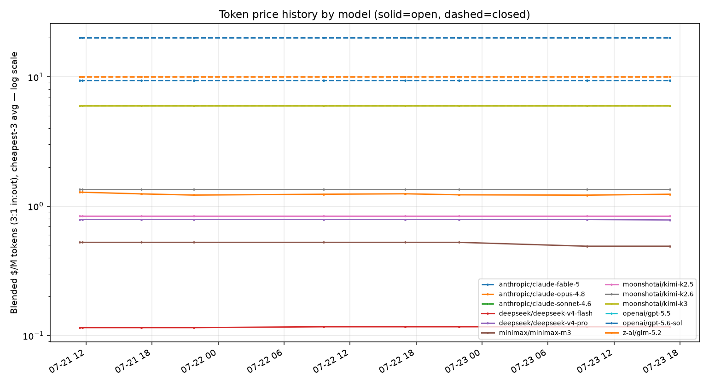
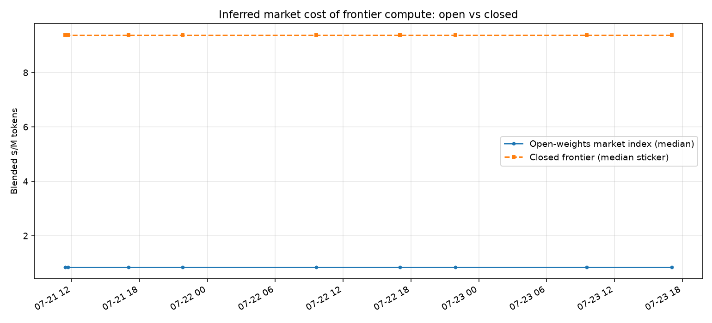
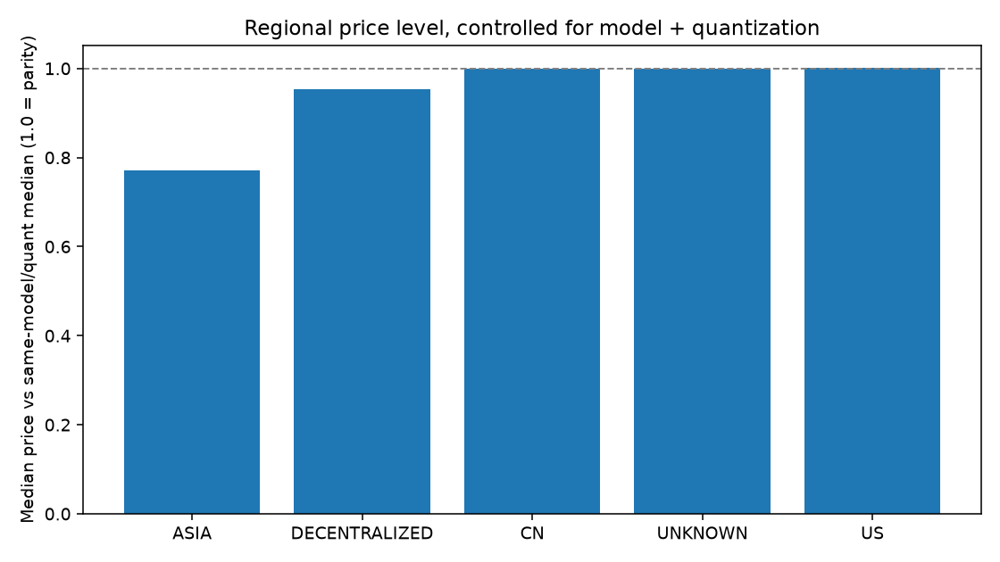

# Token Price Tracker — Summary
_Last updated: 2026-07-23 17:04 UTC · latest snapshot: 2026-07-23 17:04:41 · 9 snapshots since 2026-07-21_

## Latest market cost per model (cheapest-3 avg, blended 3:1)

| Model | Class | $/M blended | Cheapest provider | Providers |
|---|---|---|---|---|
| anthropic/claude-fable-5 | closed | $20.00 | Azure ($20.00) | 6 |
| anthropic/claude-opus-4.8 | closed | $10.00 | Azure ($10.00) | 7 |
| anthropic/claude-sonnet-4.6 | closed | $6.00 | Anthropic ($6.00) | 8 |
| deepseek/deepseek-v4-flash | open | $0.12 | DeepInfra ($0.11) | 19 |
| deepseek/deepseek-v4-pro | open | $0.78 | DeepSeek ($0.54) | 17 |
| minimax/minimax-m3 | open | $0.49 | GMICloud ($0.42) | 9 |
| moonshotai/kimi-k2.5 | open | $0.84 | DigitalOcean ($0.79) | 10 |
| moonshotai/kimi-k2.6 | open | $1.35 | Inceptron ($1.35) | 20 |
| moonshotai/kimi-k3 | open | $6.00 | Moonshot AI ($6.00) | 1 |
| openai/gpt-5.5 | closed | $9.38 | OpenAI ($5.62) | 5 |
| openai/gpt-5.6-sol | closed | $9.38 | OpenAI ($5.62) | 5 |
| z-ai/glm-5.2 | open | $1.24 | AkashML ($1.18) | 32 |

**Closed/open price multiple right now: 7.7x** (closed median $11.00 vs open $1.42)

## Regional comparison (open models, same model+quant only)

| Region | Offers | Rel. price (1.0=parity) | Median $/M |
|---|---|---|---|
| ASIA | 4 | 0.77 | $0.86 |
| DECENTRALIZED | 3 | 0.95 | $1.37 |
| CN | 20 | 1.00 | $1.27 |
| UNKNOWN | 55 | 1.00 | $1.38 |
| US | 23 | 1.00 | $1.71 |

_Caveat: this measures offer **price**, not underlying cost; regional gaps can reflect margin strategy, subsidies, or capacity, not just electricity and hardware costs._

## Charts

