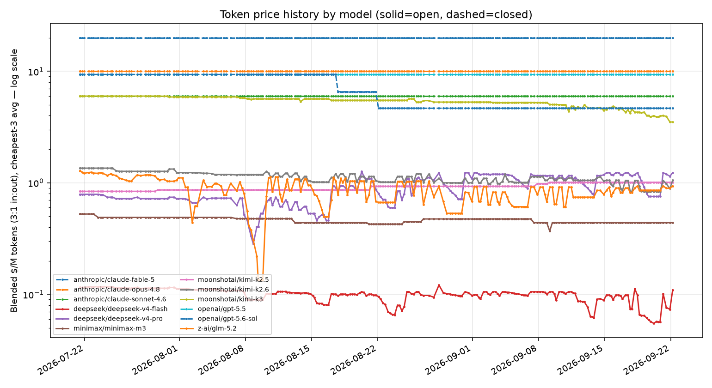
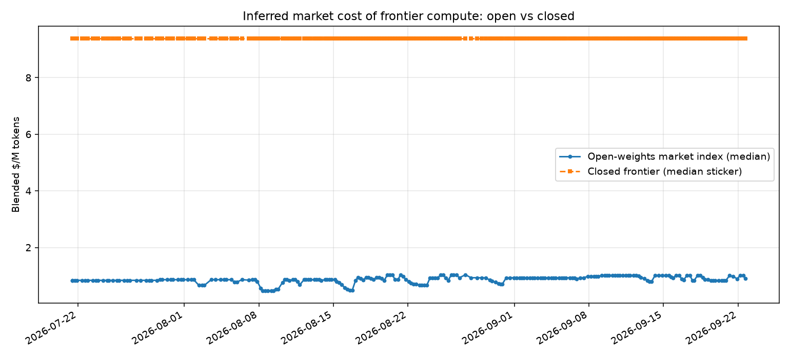
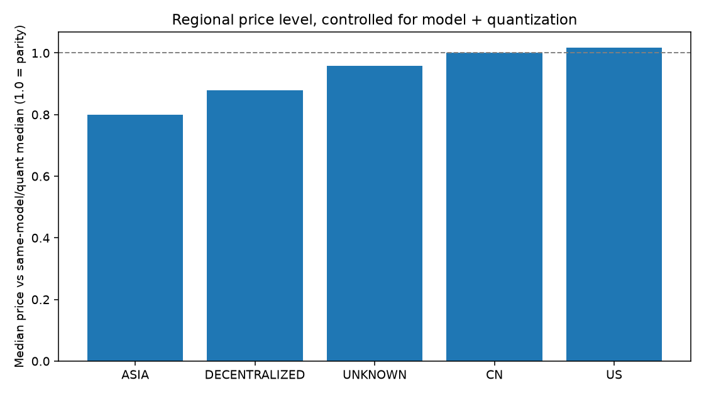

# Token Price Tracker — Summary
_Last updated: 2026-08-21 07:06 UTC · latest snapshot: 2026-08-21 07:06:41 · 106 snapshots since 2026-07-21_

## Latest market cost per model (cheapest-3 avg, blended 3:1)

| Model | Class | $/M blended | Cheapest provider | Providers |
|---|---|---|---|---|
| anthropic/claude-fable-5 | closed | $20.00 | Amazon Bedrock ($20.00) | 6 |
| anthropic/claude-opus-4.8 | closed | $10.00 | Google ($10.00) | 10 |
| anthropic/claude-sonnet-4.6 | closed | $6.00 | Claude Platform on AWS ($6.00) | 9 |
| deepseek/deepseek-v4-flash | open | $0.10 | DigitalOcean ($0.09) | 18 |
| deepseek/deepseek-v4-pro | open | $1.09 | StreamLake ($0.99) | 18 |
| minimax/minimax-m3 | open | $0.43 | CoreWeave ($0.41) | 13 |
| moonshotai/kimi-k2.5 | open | $0.93 | DeepInfra ($0.90) | 10 |
| moonshotai/kimi-k2.6 | open | $1.14 | Decart ($1.06) | 19 |
| moonshotai/kimi-k3 | open | $5.50 | Sail Research ($5.20) | 14 |
| openai/gpt-5.5 | closed | $9.38 | OpenAI ($5.62) | 7 |
| openai/gpt-5.6-sol | closed | $6.56 | OpenAI ($2.81) | 7 |
| z-ai/glm-5.2 | open | $1.04 | Ambient ($0.95) | 31 |

**Closed/open price multiple right now: 7.7x** (closed median $11.00 vs open $1.43)

## Regional comparison (open models, same model+quant only)

| Region | Offers | Rel. price (1.0=parity) | Median $/M |
|---|---|---|---|
| ASIA | 4 | 0.64 | $0.78 |
| DECENTRALIZED | 2 | 0.95 | $3.64 |
| CN | 21 | 1.00 | $1.45 |
| UNKNOWN | 52 | 1.00 | $1.26 |
| US | 29 | 1.02 | $2.15 |

_Caveat: this measures offer **price**, not underlying cost; regional gaps can reflect margin strategy, subsidies, or capacity, not just electricity and hardware costs._

## Charts

