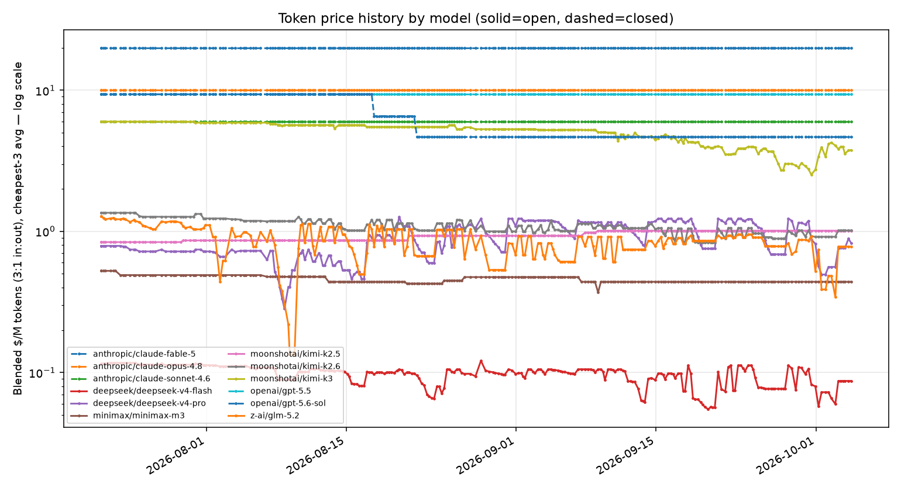
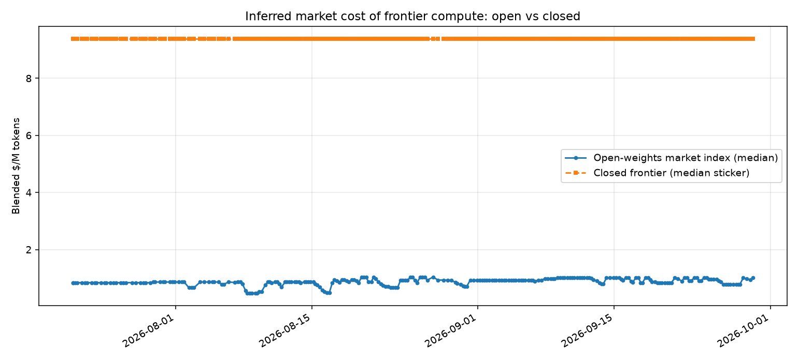
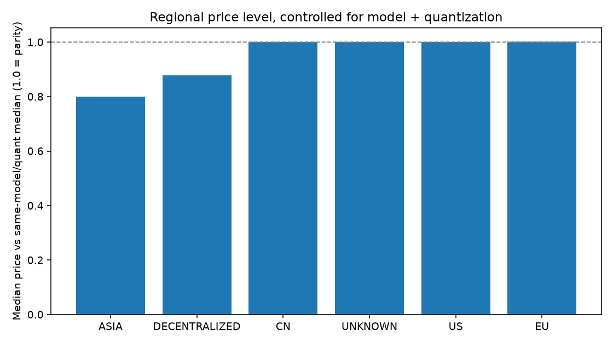

# Token Price Tracker — Summary
_Last updated: 2026-10-06 06:18 UTC · latest snapshot: 2026-10-06 06:18:02 · 273 snapshots since 2026-07-21_

## Latest market cost per model (cheapest-3 avg, blended 3:1)

| Model | Class | $/M blended | Cheapest provider | Providers |
|---|---|---|---|---|
| anthropic/claude-fable-5 | closed | $20.00 | Claude Platform on AWS ($20.00) | 6 |
| anthropic/claude-opus-4.8 | closed | $10.00 | Claude Platform on AWS ($10.00) | 11 |
| anthropic/claude-sonnet-4.6 | closed | $6.00 | Claude Platform on AWS ($6.00) | 9 |
| deepseek/deepseek-v4-flash | open | $0.09 | StreamLake ($0.05) | 16 |
| deepseek/deepseek-v4-pro | open | $0.89 | StreamLake ($0.26) | 16 |
| minimax/minimax-m3 | open | $0.44 | CoreWeave ($0.41) | 13 |
| moonshotai/kimi-k2.5 | open | $1.01 | SiliconFlow ($0.90) | 5 |
| moonshotai/kimi-k2.6 | open | $1.02 | Inceptron ($0.96) | 18 |
| moonshotai/kimi-k3 | open | $3.76 | Relace ($3.52) | 24 |
| openai/gpt-5.5 | closed | $9.38 | OpenAI ($5.62) | 7 |
| openai/gpt-5.6-sol | closed | $4.67 | OpenAI ($2.00) | 7 |
| z-ai/glm-5.2 | open | $0.90 | Decart ($0.83) | 33 |

**Closed/open price multiple right now: 6.7x** (closed median $10.00 vs open $1.50)

## Regional comparison (open models, same model+quant only)

| Region | Offers | Rel. price (1.0=parity) | Median $/M |
|---|---|---|---|
| ASIA | 5 | 0.80 | $1.20 |
| DECENTRALIZED | 2 | 0.88 | $3.54 |
| UNKNOWN | 59 | 1.00 | $1.71 |
| CN | 19 | 1.00 | $1.45 |
| EU | 1 | 1.00 | $2.15 |
| US | 29 | 1.00 | $2.15 |

_Caveat: this measures offer **price**, not underlying cost; regional gaps can reflect margin strategy, subsidies, or capacity, not just electricity and hardware costs._

## Charts

