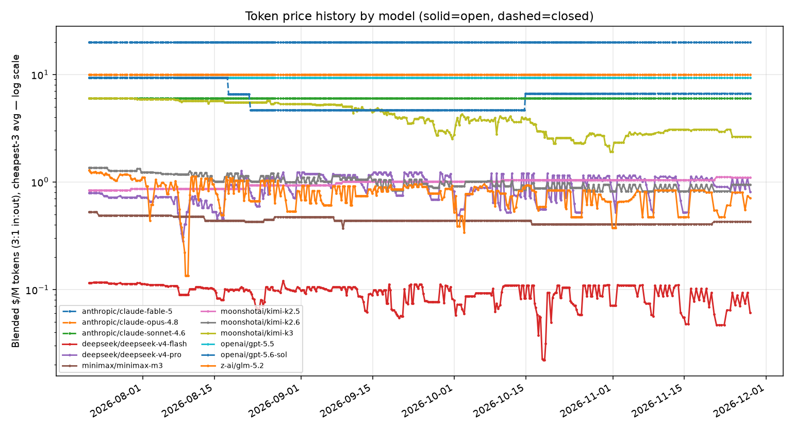
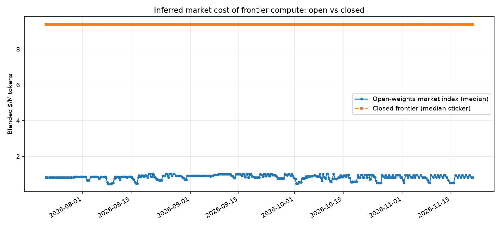

# Token Price Tracker — Summary
_Last updated: 2026-11-20 20:13 UTC · latest snapshot: 2026-11-20 20:13:32 · 407 snapshots since 2026-07-21_

## Latest market cost per model (cheapest-3 avg, blended 3:1)

| Model | Class | $/M blended | Cheapest provider | Providers |
|---|---|---|---|---|
| anthropic/claude-fable-5 | closed | $20.00 | Claude Platform on AWS ($20.00) | 4 |
| anthropic/claude-opus-4.8 | closed | $10.00 | Claude Platform on AWS ($10.00) | 6 |
| anthropic/claude-sonnet-4.6 | closed | $6.00 | Claude Platform on AWS ($6.00) | 5 |
| deepseek/deepseek-v4-flash | open | $0.06 | StreamLake ($0.04) | 14 |
| deepseek/deepseek-v4-pro | open | $0.94 | StreamLake ($0.88) | 14 |
| minimax/minimax-m3 | open | $0.43 | DeepInfra ($0.39) | 8 |
| moonshotai/kimi-k2.5 | open | $1.04 | AtlasCloud ($0.99) | 4 |
| moonshotai/kimi-k2.6 | open | $0.82 | Baidu ($0.70) | 16 |
| moonshotai/kimi-k3 | open | $3.09 | Wafer ($2.61) | 29 |
| openai/gpt-5.5 | closed | $9.38 | OpenAI ($5.62) | 4 |
| openai/gpt-5.6-sol | closed | $6.67 | OpenAI ($4.00) | 5 |
| z-ai/glm-5.2 | open | $0.55 | StreamLake ($0.46) | 31 |

**Closed/open price multiple right now: 6.8x** (closed median $10.00 vs open $1.47)

## Regional comparison (open models, same model+quant only)

| Region | Offers | Rel. price (1.0=parity) | Median $/M |
|---|---|---|---|
| DECENTRALIZED | 2 | 0.71 | $2.25 |
| UNKNOWN | 46 | 0.88 | $1.57 |
| CN | 18 | 1.00 | $1.54 |
| US | 39 | 1.07 | $1.62 |
| EU | 2 | 1.33 | $4.08 |

_Caveat: this measures offer **price**, not underlying cost; regional gaps can reflect margin strategy, subsidies, or capacity, not just electricity and hardware costs._

## Charts

